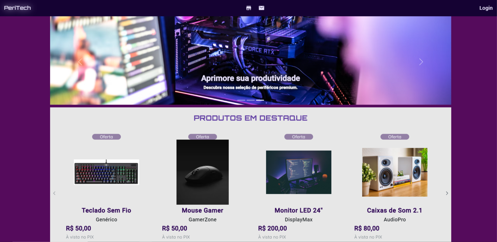
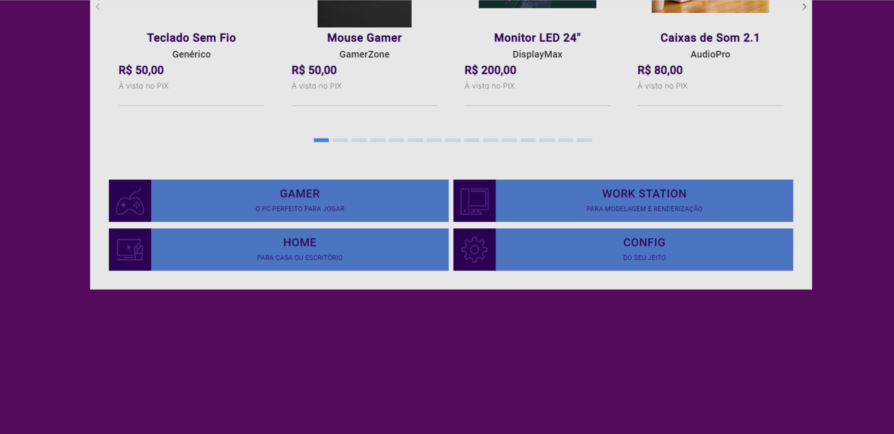
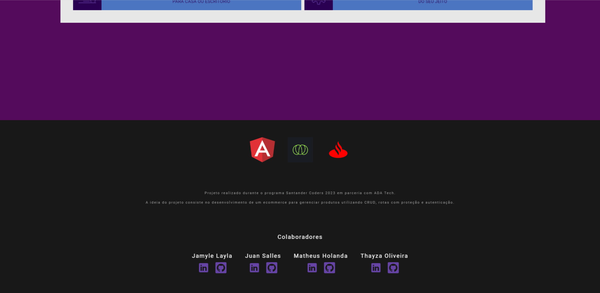
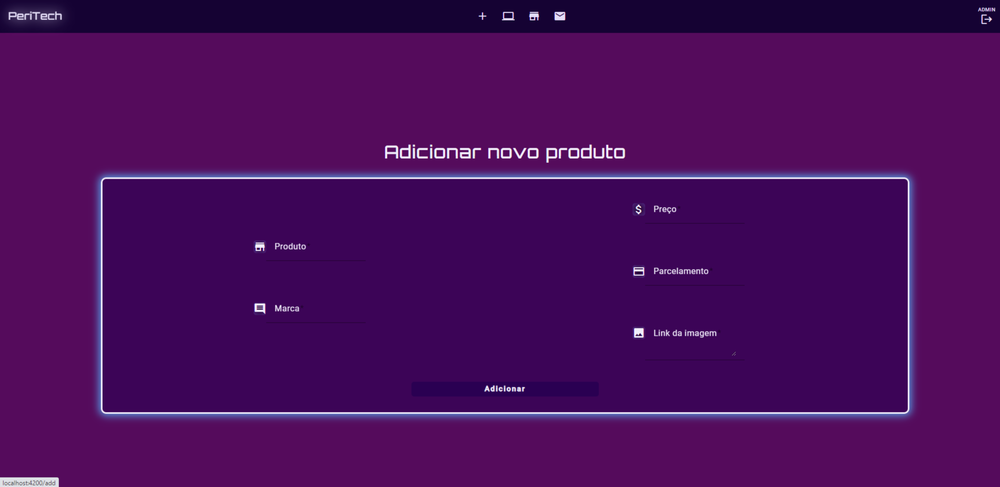
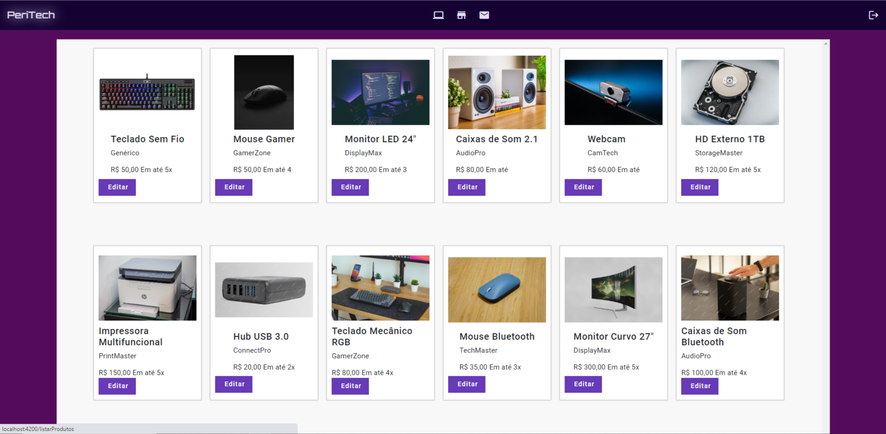
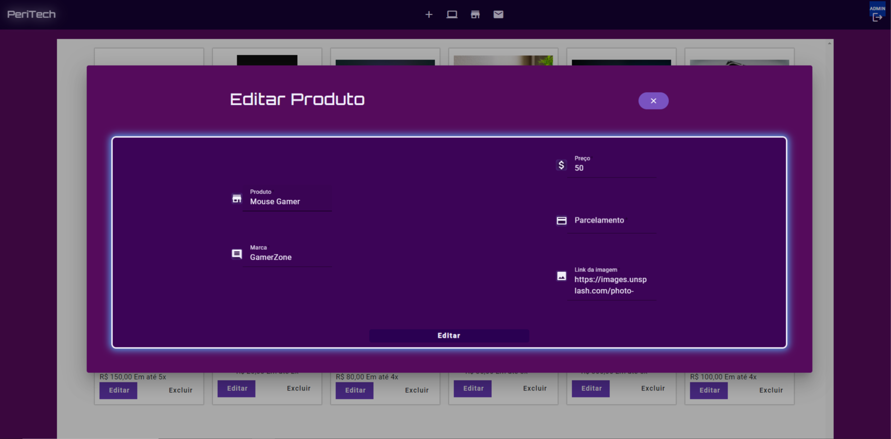
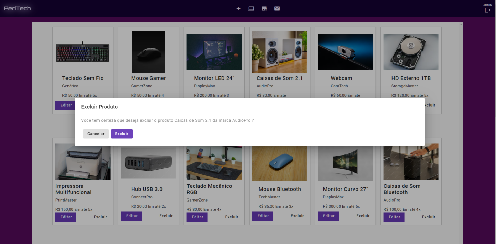

# <h1 align='center'>E-COMMERCE </h1>

## Description 📚

This is the final project of the Angular Framework II module of the Santander Coders program. The project consists of a web application that displays the interface of a e-commerce website containing home page, add products page and all products page. Additionally, there is a difference in the header icons and acess allowed pages for different type of user. We used HTML, SCSS, Bootstrap, Typescript, and Angular to create the interface and interactivity of the application. The concept of componentization, Input and Output and validated form were used. Project versioning was done using Git and Github, allowing each group member to contribute and track changes.

## Technologies Used 🚀

- HTML
- SCSS
- Bootstrap
- Typescript
- Angular
- Git e Github

## Main Features 🌟

- Home page;
- Add products page;
- Edit and delete product Dialog
- Products listing page;
- Login acess with authorization/authentication;
- Use of Input and Output;
- Use Module that agroup Angular Material
- DB JSON server

## Installation 🔧

To run this project locally, follow these steps:

1. Clone this repository:

```bash
git clone https://github.com/DevSquad-SantanderCoders/resume-project.git
```

2. Navigate to the directory:

```bash
cd resume-project
```

3. Install the dependencies using npm:

```bash
npm install
```

## Execution ▶

To start the project, run the following command:

```bash
ng serve
```

## Preview

<div align='center' >

   <h3> Home Page </h3>
   
   <h3> Home Page </h3>
   
   <h3> Footer </h3>
   
   <h3> Login </h3>
   
   <h3> Add Product Form </h3>
   
   <h3> Product Listing Page - ADMIN </h3>
   
   <h3> Product Listing Page - FUNCIONARIO  </h3>
   
   <h3> Dialog Edit - ADMIN </h3>
   
   <h3> Dialog Delete - ADMIN  </h3>
   

</div>

## Authors 👩🏻‍💻👨🏻‍💻

- [Jamyle Layla](https://github.com/JamyleTeles)
- [Juan Salles](https://github.com/JuanSalles)
- [Matheus Holanda](https://github.com/MMatheus-Holanda)
- [Thayza Oliveira](https://github.com/tthayza)
